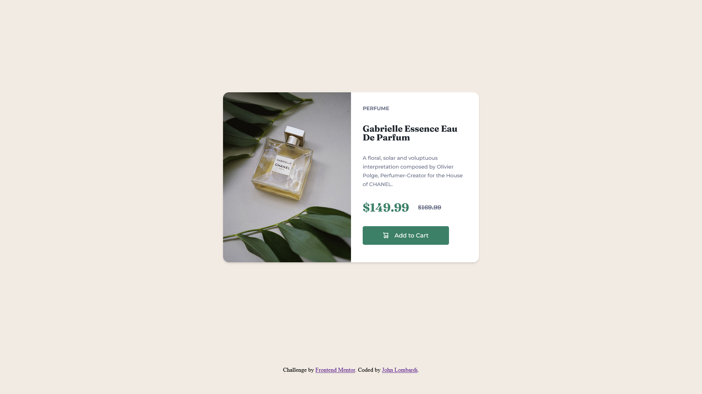

# Product Preview Card Component



## Table of contents

- [Overview](#overview)
  - [Links](#links)
- [My process](#my-process)
  - [Tools](#tools)
  - [What I learned](#what-i-learned)
- [Author](#author)
- [Credits](#credits)

## Overview

Creating a product preview card that matches a given design as closely as possible for the product preview card component challenge on Frontend Mentor. Everything was coded using html and sass, along with git for version control.

### Links

- Live Site URL: [Product Preview Card](https://johnlombardi389.github.io/product-preview-card/)

## My process

### Tools

- HTML5
- CSS / SASS
- Flexbox
- CSS Grid
- Visual Studio Code
- Git

### What I learned

- Learning how to use Sass to write more maintainable and scalable CSS code
- Using CSS Grid to organize content on the page at different screen sizes
- Apply my skills in HTML, CSS, and Sass, to help become more proficient as a web developer

Example from the project:

```css
.card {
  display: grid;
  grid-template-columns: 350px 350px;
  grid-template-rows: auto;
  border-radius: 1rem;
  overflow: hidden;
  img {
    max-width: 350px;
    height: auto;
    object-fit: contain;
  }
  .info-container {
    grid-column: 2;
    grid-row: 1;
  }
}
```

## Author

John Lombardi

- [Portfolio](https://johnlombardi389.github.io/portfolio/)
- [LinkedIn](https://www.linkedin.com/in/johnlombardi389/)
- [GitHub](https://github.com/johnlombardi389)
- [Frontend Mentor](https://www.frontendmentor.io/profile/johnlombardi389)

### Credits

- Perfume Photo by [Olena Sergienko](https://unsplash.com/@olenkasergienko?utm_source=unsplash&utm_medium=referral&utm_content=creditCopyText) on [Unsplash](https://unsplash.com/photos/GOVTETevRm8?utm_source=unsplash&utm_medium=referral&utm_content=creditCopyText)
